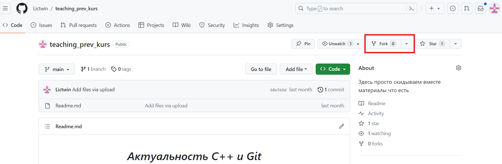
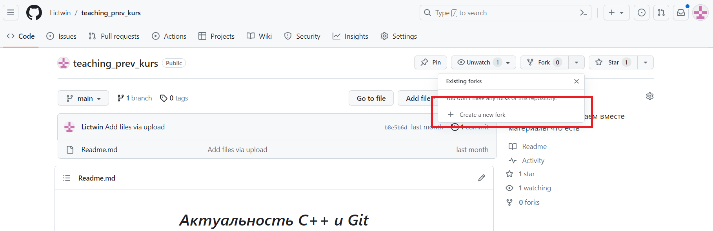
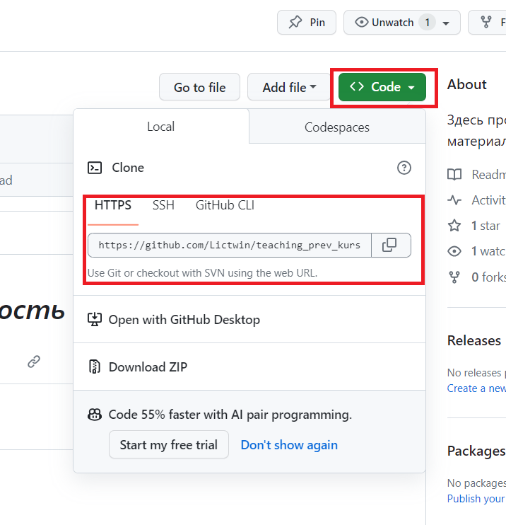
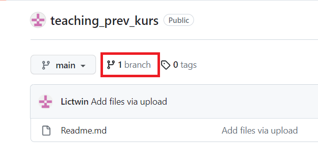
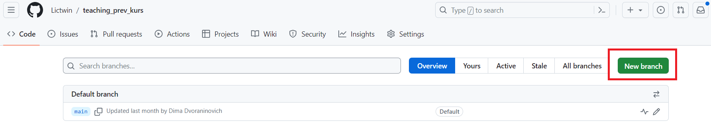
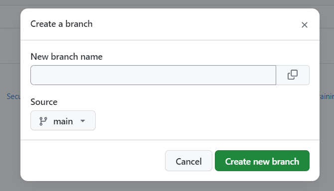

Как закидывать файлы на ГитХаб
======

Данная статья существует просто для обучения студентов закидыванию файлов на Гитхаб.

Статья не претендует на полноту и объяснение работы ГитХаба, однако позволит следуя простым шагам закидывать лабы на ГитХаб.

С чего начать
======

 Самое первое, что необходимо сделать, это скачать и установить утилиту git. Без неё дальнейшая работа невозможна. Так же вам необходимо зарегистрироваться на ГитХабе и принять приглашение в репозиторий от преподавателя.

С чего начинается работа в репозитории
======

Гитхаб как платформа строится на идее веток. Существует главная ветка, от которой идут боковые ветки, в которых производится разработка. При завершении разработки ветка сливается в основную ветку и код из обоих веток соединяется. 

Для создания ветки необходимо произвести fork в Гитхабе и создать собственную ветку:






Таким образом создайте новую ветку и перейдите в неё.

Команда git clone
======

Оказавшись в своём репозитории вам необходимо как-то перенести данные из облачного репозитория в свой локальный на компьютере. Для этого существует команда git clone *ссылка на репозиторий* . (Важно, ссылка должна быть на свой репозиторий, на вашу ветку, а не на основную ветку проекта) 



Для переноса данных с облачного репозитория на ваш локальный, в консоли перейдите в каталог, где хотите разместить репозиторий и введите команду

```
git clone ссылка на репозиторий
```

После чего вы увидите как в вашем каталоге появилась новая папка, в которой распологается ваш локальный репозиторий. перейдите в данную папку через консоль.

Создание веток
======

Для успешной работы в репозитории необходимо создавать ветки в которых  будут находиться изменения. Это производится через сайт ГитХаба.







В данном контекстном меню вводим название ветки и создаём её. 

После создания ветки обновляем наш локальный репозиторий командой 

```
git pull
```

Данная команда забирает изменения из облачного репозитория в ваш локальный и обновляет его. Данную команду необходимо использовать после всех действий в вашем облачном репозитории. Данная процедура позволит избежать проблем с совместимостью.

Работа в ветках Гита
======

По умолчанию основная ветка в репозитории остаётся main. Однако нам необходимо перейти в ранее созданную ветку. для это используется команда:

```
git checkout название ветки
```

Вы в любой момент можете проверить в какой ветке вы находитесь с помощью команды:

```
git status
```

Данная команда позволяет не только узнать, в какой ветке вы находитесь, но и проверить какие новые файлы вы закинули в проект.

После прохождения всех предварительных этапов вы можете изменять файлы проекта, добавлять или убирать файлы. 

Это может производиться через любой файловый менеджер.

Как отправить изменения на основной репозиторий
======

Для отправки изменений на основной репозиторий необходимо выполнить ряд шагов. Самый первый: поместить файлы в буфер с помощию команды

```
git add *
```

С помощью данной команды можно отправить в буфер как отдельный файл (вместо символа * наименование файла), так и все новые файлы сразу (с помощью символа *)

После того, как все желаемые файлы отправлены в буфер необходимо создать коммит для дальнейшей отправки в репозиторий. Для этого используется команда:

```
git commit -m "Название"
```

После создания коммита необходимо отправить его на наш репозиторий. Данная операция производится с помощью команды: 

```
git push
```

Что делать дальше
======

В дальнейшем необходимо отправить измения в сам репозиторий. Для этого заходим в Branch и напротив необходимой ветви прожимаем new pull request и создаем новый запрос на изменение.

Если необходимо внести в pull request изменения, то для ветки, которая отправлена в pull request выполнить шаги с раздела "Работа в ветках Гита"

Помните, обновляйте свой репозиторий, при изменениях в родительском репозитории и при изменении в своём репозитории. Данные операции производятся в облачном репозитории через sync fork и локальном репозитории через git pull.

При необходимости потренеруйтесь на данном репозитории закидывать файлы и посмотрите на ваши результаты.

